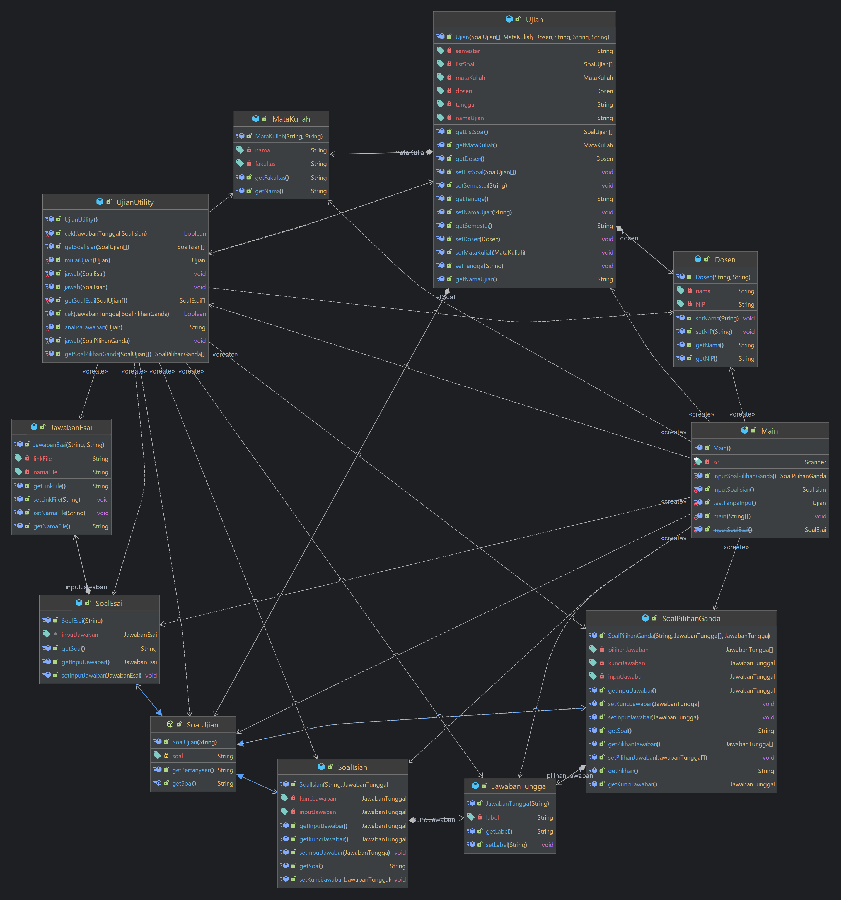

# Ujian Sisipan 2 PBO

### KASUS E (Program pengelola ujian mata kuliah)
Akan dibuat sebuah program untuk mengelola ujian mata kuliah. 
Program tersebut akan dapat menyimpan data mata kuliah dan beberapa soal ujian mata kuliah tersebut. 
Untuk soal ujian berupa pilihan ganda, jawaban hanya berupa karakter A,B dst. 
Untuk soal ujian berupa jawaban singkat, jawaban berupa string maksimal 20 karakter. 
Sedangkan untuk jawaban essay berupa nama file gambar dan link tempat file gambar tersebut.

### UML DIAGRAM

    

### TUGAS PER MINGGU
- [x] **Minggu 1 (16/05/2023)**
  1. Tulis ulang kasus tersebut dan berikan penjelasan lebih detail
  kasus tersebut. Dan kasus boleh dikembangkan. Akan ada
  penambahan nilai. Misal : program akan menyimpan data ~~blabla~~. Program juga dapat memproses ~~bla-bla-bla~~
  2. Buatlah diagram UML untuk menyelesaikan kasus tersebut.
  Kasus tersebut diselesaikan dengan menggunakan inheritance
  dan polymorphism. Perhatikan prinsip-prinsip berorientasi
  obyek dalam membuat kelas.
  3. Kalian dapat menambahkan kelas interface.
  4. Hasil minggu 1 dipresentasikan di minggu 2 (23/05/2023)
  
- [x] **Minggu 2 (23/05/2023)**
  1. Buatlah implementasi kelas pendukungnya termasuk atribut
  dan method. Jika terdapat perubahan diagram kelas
  diperbolehkan.
  2. Buat laporan berupa penjelasan setiap method dan atribut
  kelas tersebut. Kasus dan diagram UML dari minggu 1 tetap
  disertakan dalam laporan.
  3. Hasil minggu 2 dipresentasikan di minggu 3 (30/05/2023)
  
  
- [x] **Minggu 3 (16/05/2023)**
  1. Buatlah implementasi kelas main yang mengelola kasus
  tersebut. Semakin user friendly dan lengkap program main
  akan semakin tinggi nilainya. Jika ternyata saat membuat
  main akan menambahkan kelas atau atribut atau method
  dipersilahkan.
  2. Buat laporan berupa penjelasan dan algoritma program main
  tersebut. Kasus, diagram UML dan penjelasan setiap kelas
  dari minggu 1 dan ke-2 tetap disertakan dalam laporan
  sehingga menjadi dokumen utuh.
  3. Hasil minggu 2 dipresentasikan di minggu 3 (06/06/2023)